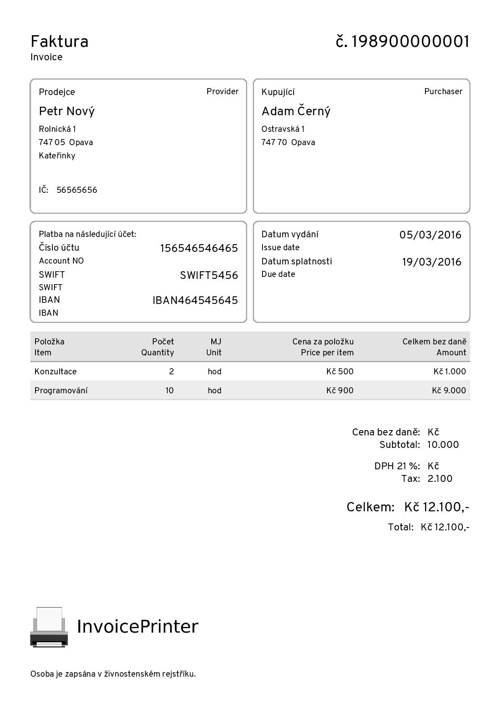

# CvPrinter

**Super simple CV and resume PDF generator.** CvPrinter is a pure Ruby library to generate CVs and resumes in no time. You can use Ruby or JSON as the invoice representation to build the final PDF.

CvPrinter is a sister library and a fork of [InvoicePrinter](https://github.com/strzibny/invoice_printer).

**This is just a preview. Most things aren't implemented and the gem is not released.**

## Philosophy

- **Simple**, no styling required, no hard to understand configuration
- **Pure Ruby**, no dependency on system libraries or browsers
- **Fast**, so you can render PDFs on the fly during requests

## Examples

| Simple invoice |
| -------------- |
| <a href="https://github.com/strzibny/cv_printer/raw/master/examples/promo.pdf"></a>|

See more usecases in the `examples/` directory.

## Features

Supported document configuration:

- A4 and US letter paper size
- Custom field labels & sublabels
- Custom font file
- Picture (as image scaled to fit 50px of height)
- QR code
- Background (as image)

Supported sections:

- Name
- Contact
- Experience
- Education
- Certificates
- Skills
- Languages
- References
- Publications
- Awards

Read [documentation](./docs/LIBRARY.md) for more details.

## Support

I am developing CvPrinter as a free and MIT-licensed library. Please consider [buying my book](https://deploymentfromscratch.com/) or signing up for [LakyAI](https://lakyai.com/) to support my efforts.

## Contributing

Contributions are welcome. Make sure the tests are passing before submitting a PR:

```bash
$ bundle && bundle exec rake test
```

You can also quickly regenerate the examples if necessary:

```bash
$ ruby regenerate.rb
```

## Copyright

Copyright 2025 &copy; [Josef Strzibny](http://strzibny.name/). MIT licensed.
